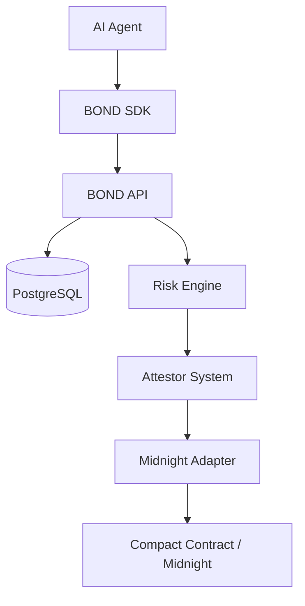

# BOND

**Privacy-Preserving Security Infrastructure for Autonomous AI Agents**

Collateral, risk intelligence, independent attestation, and automated enforcement for autonomous AI agents.

## Overview

Autonomous AI agents act with real consequences — spending funds, calling tools, touching production systems — but they operate without accountability. BOND gives every agent a bonded identity: stake collateral, prove eligibility with zero-knowledge proofs, submit activity for deterministic risk analysis, and face independent attestor review with automated on-chain enforcement when violations are confirmed.

## The Problem

AI agents are increasingly autonomous and increasingly trusted, yet there is no standard layer that:

- holds agents financially accountable for misbehavior,
- detects policy violations deterministically and explainably,
- verifies findings independently before acting on them,
- enforces consequences without trusting a single party,
- does all of the above without exposing private data.

## The Solution

BOND combines five mechanisms into one protocol:

- **Collateral** — agents lock bonded value before operating. Misbehavior puts real stake at risk.
- **Risk intelligence** — deterministic rules, behavioral detectors, and policy checks turn activity into explainable findings with severity and confidence.
- **ZK eligibility** — agents prove collateral sufficiency without revealing amounts, salts, or secrets.
- **Independent attestation** — a quorum of attestors confirms or rejects findings. Raw flags alone can never trigger enforcement.
- **Reputation** — standing derived from confirmed history, visible publicly without leaking internals.
- **Automated enforcement** — attested decisions execute partial or full slashes deterministically.

## Core Principle

**AI detects. Attestors verify. The contract enforces.**

The AI Risk Engine is advisory only: it cannot sign transactions, hold wallets, slash bonds, or touch chain state. Enforcement flows exclusively through attestor quorum → decision → tracked transaction.

## How BOND Works

```
REGISTER → BOND → PROVE → OPERATE → ASSESS → ATTEST → ENFORCE → WITHDRAW
```

1. **Register** an agent under an operator identity.
2. **Bond** collateral against the agent.
3. **Prove** eligibility with a zero-knowledge statement.
4. **Operate** — the agent acts; activity is reported via SDK.
5. **Assess** — the Risk Engine analyzes activity into flags.
6. **Attest** — independent attestors reach quorum on findings.
7. **Enforce** — decided actions slash through explicit transactions.
8. **Withdraw** — clean agents release collateral.

## Architecture



| Layer            | Location                      | Role                                              |
| ---------------- | ----------------------------- | ------------------------------------------------- |
| Web UI           | `apps/web`                    | React + Vite security dashboard (this redesign)   |
| API              | `apps/api`                    | Express, auth, policy, risk orchestration, worker |
| Risk Engine      | `packages/risk-engine`        | Deterministic analyzers + scoring (advisory)      |
| Policy Engine    | `packages/policy-engine`      | Versioned operational policies, threshold checks  |
| Attestor         | `packages/attestor`           | Quorum evaluation, decision issuance              |
| Contract         | `packages/contract`           | Normative rule model mirrored in Compact          |
| Midnight Adapter | `packages/midnight-adapter`   | SIMULATED execution + REAL chain seams            |
| SDKs             | `packages/sdk`, `sdks/python` | TypeScript + Python clients, builders, adapters   |

## Security Model

Three separated powers, enforced by architecture and boundary tests:

- **AI Risk Engine** — reports findings. No chain imports, no wallet, no enforcement calls.
- **Attestors** — independent quorum confirms or rejects. No access to risk internals beyond the flag.
- **Smart Contract** — executes slashes only from attested decisions with valid nullifiers.

The Risk Engine does not directly control enforcement because flags are advisory data: only a decided attestation plus an explicit, tracked transaction can move funds.

## Privacy

- Bond principals live as commitments — amounts, salts, and secrets never touch the ledger or logs.
- Eligibility proves statements, never values; witnesses stay in per-call private state.
- API responses use allowlisted DTOs; public verification exposes standings and bands, never amounts, witnesses, or evidence.
- Browser storage holds session tokens and IDs only — no secrets, prompts, or raw activity.

## Features

What actually exists today:

- Agent registration, credentials with scoped capabilities, delegated setup grants
- Per-agent operational policies with versioned amendments
- Risk analysis (rule, behavioral, and policy detectors) with explainable findings
- Multi-agent delegation with server-derived attribution
- Reputation and trust levels from verified outcomes
- Attestor registration, quorum verdicts, decisions, enforcement intents
- Bond fund / release / withdraw lifecycle with transaction tracking
- ZK eligibility proofs (SIMULATED fixtures; REAL circuit args ready)
- Event feed, public verification, protocol status dashboard
- Delegated setup grants and agent-scoped SDK clients

## Agent Integrations

- **TypeScript SDK** (`packages/sdk`): `BondClient` (operator) + `BondAgentClient` (restricted), activity builders, policy/delegation/reputation calls, protocol-vector-tested payloads.
- **Python SDK** (`sdks/python/bond_sdk`): same surface plus framework adapters — LangGraph, CrewAI, AutoGen, and a generic boundary — and provider usage normalizers (OpenAI, Anthropic, Gemini, DeepSeek, local/custom). No provider packages required.
- **Demos** (`sdks/demo`): scripted benign/risky/behavioral/reputation/policy/delegation/providers scenarios, all deterministic and offline-safe.

## Technology Stack

TypeScript + React + Vite (web), Express + Node 20 (API), PostgreSQL 16, Vitest, ESLint + Prettier, Docker + nginx, Compact 0.31 / Midnight.js 4.1 (blockchain seam), Python 3.10+ with httpx/pytest (SDK + demos).

## Project Structure

```text
bond/
├── apps/
│   ├── web/                  # React dashboard (this UI)
│   └── api/                  # Express API + worker + services
├── packages/
│   ├── shared-types/         # Domain types, errors, reputation/delegation
│   ├── risk-engine/          # Deterministic rules + scoring
│   ├── policy-engine/        # Policy evaluation (pure)
│   ├── attestor/             # Quorum + decision logic
│   ├── contract/             # Normative rule model
│   ├── midnight-adapter/     # SIMULATED execution + REAL seams
│   └── sdk/                  # TypeScript SDK
├── sdks/python/              # Python SDK + framework/provider adapters
├── sdks/demo/                # Scripted integration demos
├── sdks/protocol/vectors/    # Cross-language protocol fixtures
├── contracts/                # Compact contract + generated artifacts
├── database/migrations/      # Versioned SQL migrations (016+)
└── docs/                     # Phase docs, runbooks, privacy model
```

## Local Development

```bash
cp .env.example .env
npm install
npm run typecheck
npm run lint
npm test
npm run build

# PostgreSQL only:
docker compose up -d db

# Full stack:
docker compose up --build
```

- Web dev: `npm run dev:web` → http://localhost:5173
- API dev: `npm run dev:api` → http://localhost:4000/health
- Production preview (compose): web http://localhost:8080, API http://localhost:4000
- Python SDK: `pip install ./sdks/python` (or `PYTHONPATH=sdks/python`)

## Environment Variables

| Variable                | Purpose                                                               |
| ----------------------- | --------------------------------------------------------------------- |
| `DATABASE_URL`          | PostgreSQL connection (required)                                      |
| `DEV_AUTH_TOKEN`        | Local dev sessions (never production)                                 |
| `CORS_ORIGIN(S)`        | Allowed frontend origin(s); `*` rejected                              |
| `MIDNIGHT_NETWORK`      | empty/`simulated` → SIMULATED; `undeployed`/`preprod` → REAL config   |
| `BOND_CONTRACT_ADDRESS` | Required for REAL networks                                            |
| `BOND_ZK_ASSETS_PATH`   | Compiled contract assets (defaults into repo)                         |
| `VITE_API_URL`          | API origin baked into the web bundle (required for production builds) |

SIMULATED is the default and is always labeled as such. PREPROD requires explicit network selection, a deployed contract address, and a funded wallet — see `docs/phase-25`. Mainnet is not enabled.

## Running the Application

```bash
docker compose up --build
```

Open **http://localhost:8080**, sign in with the development key (local only) or a Midnight wallet, then register an agent from the dashboard.

## Demo Flow

```bash
BOND_DEMO_SCENARIO=benign python sdks/demo/ai_agent_demo.py
BOND_DEMO_SCENARIO=risky python sdks/demo/ai_agent_demo.py
```

Working local flow: agent registration → risk analysis → attestation (quorum → decision) → bond lifecycle (fund → enforce → withdraw) → transaction tracking → public verification. All Midnight effects are SIMULATED (`sim-` ids) unless a REAL ceremony was performed.

## Midnight Integration

The adapter executes the normative rule model in-memory (SIMULATED, explicitly labeled) and exposes REAL seams (submission, confirmation, reconciliation, eligibility circuits) that fail closed without a wallet, contract address, and reachable network. No REAL execution has been performed in this environment; see `docs/phase-25` for the wallet-attended ceremony. Do NOT claim mainnet deployment — it does not exist.

## Testing

```bash
npm test                  # full Vitest suite (API needs PostgreSQL, see TEST_PG_* / TEST_*_DATABASE_URL)
npm run typecheck && npm run lint && npm run format:check && npm run build
PYTHONPATH=sdks/python python -m pytest sdks/python/tests sdks/demo/tests -q
```

## Production Readiness

Code-complete for SIMULATED-supervised operation: fail-closed configuration, graceful shutdown, pooled DB with advisory-locked manual migrations, idempotent workers, authenticated/authorized routes, rate limiting, structured logging, Docker images, and CI coverage. Live Midnight operation additionally requires the funded-wallet + deployment ceremony (external blockers, documented in `docs/phase-25` and `docs/phase-28`).

## Security Notes

- Never commit secrets; `.env` is local-only and git-ignored.
- Never expose wallet seed phrases or private keys — the backend never holds them.
- Do not treat testnet resources as production funds.
- The AI Risk Engine does not directly control enforcement — only attested decisions plus explicit transactions move value.
- Report suspected vulnerabilities through the repository's issue process, never in public logs or fixtures.

## Roadmap

Completed: foundation (1–16) → developer integration (17–19) → behavioral risk (20) → reputation (21) → policy engine (22) → multi-agent delegation (23) → developer platform (24) → Midnight integration groundwork (25) → ZK/privacy hardening (26) → production hardening (27) → launch validation (28) → security UI redesign (this).

Remaining: wallet-attended Midnight ceremony (funding + deployment + live verification), then production launch.

## License

No root license file is currently declared in this repository (the Python SDK package metadata names MIT; treat the root as unlicensed until clarified).
