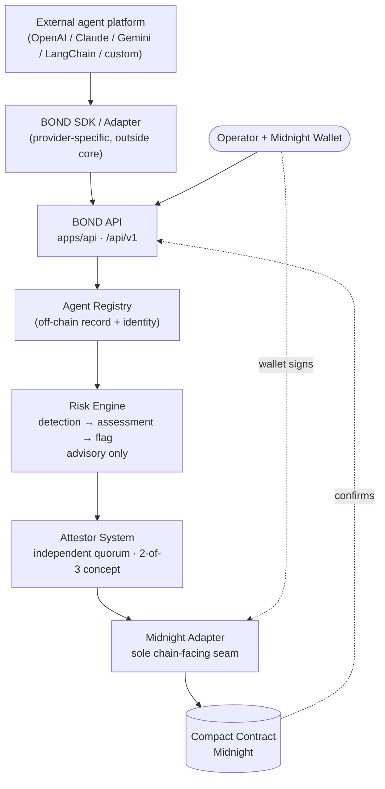
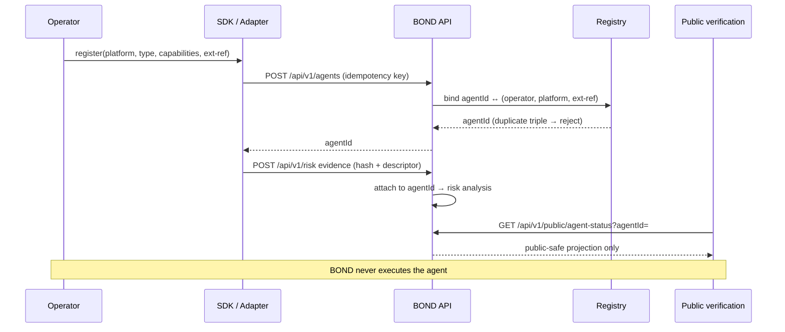
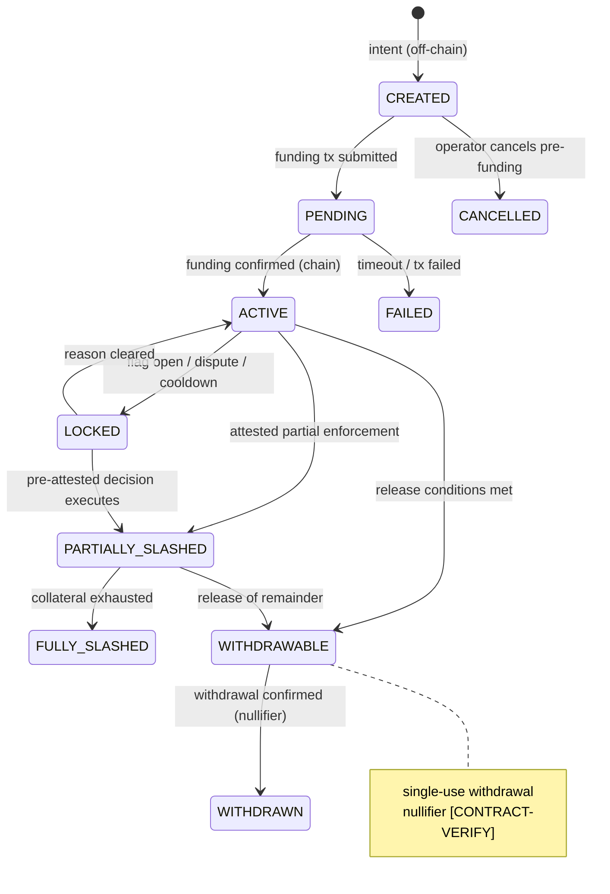
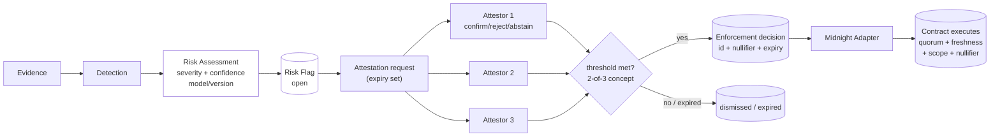
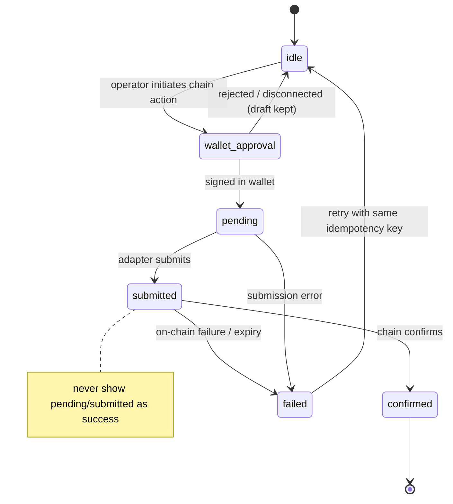
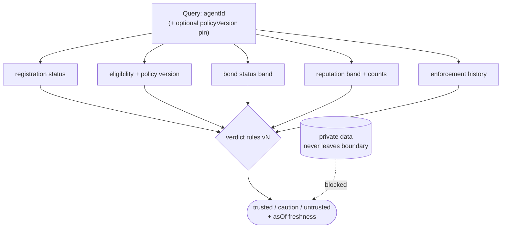

# 16 — Architecture diagrams

> All diagrams are conceptual. Chain-side details are
> **[VERIFY-MIDNIGHT]** and subject to official-docs confirmation.

## 16.1 Overall system architecture



## 16.2 Agent integration



## 16.3 Agent lifecycle

```mermaid
stateDiagram-v2
    [*] --> UNREGISTERED
    UNREGISTERED --> REGISTERED: operator registers (off-chain)
    REGISTERED --> BONDED: bond confirmed (chain)
    BONDED --> ELIGIBLE: policy + ZK check pass
    ELIGIBLE --> ACTIVE: operator marks in-service
    ACTIVE --> FLAGGED: risk flag opened (auto)
    FLAGGED --> ATTESTED: quorum decision recorded
    FLAGGED --> RESOLVED: dismissed / expired
    ATTESTED --> SLASHED: enforcement executed
    ATTESTED --> RESOLVED: no enforcement
    SLASHED --> RESOLVED: incident closed
    ACTIVE --> SUSPENDED: pause (operator/policy)
    FLAGGED --> SUSPENDED: pause
    SUSPENDED --> ACTIVE: resume
    BONDED --> WITHDRAWABLE: bond released
    WITHDRAWABLE --> [*]
    note right of FLAGGED: invalid: FLAGGED→ACTIVE<br/>without resolution
```

## 16.4 Bond lifecycle



## 16.5 Risk → Attestation → Enforcement



## 16.6 Wallet / transaction flow



## 16.7 Public verification


