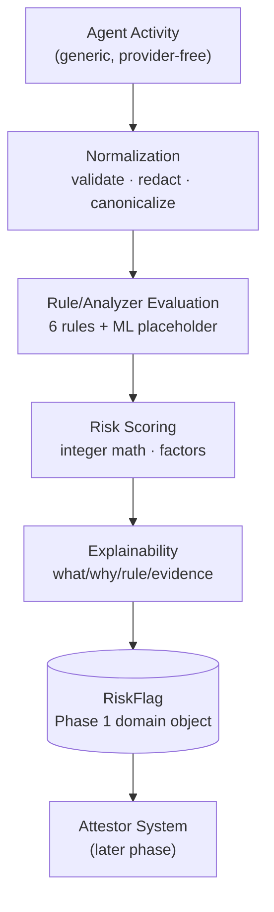

# BOND Phase 2 — AI Risk Engine Foundation

> Advisory only. The engine reports; attestors verify; enforcement acts.
> No chain, wallet, crypto, AI inference, DB, HTTP, or UI in this package.

## 1. Phase 2 purpose

Turn generic agent activity into structured Phase 1 `RiskFlag` objects
through deterministic, explainable, versioned rules — establishing the
trustworthy foundation that future ML/LLM analyzers will plug into.

## 2. Risk Engine architecture

```text
Agent Activity
      ↓
Normalization (input.ts: validate, redact secrets, canonicalize)
      ↓
Rule/Analyzer Evaluation (rules.ts: 6 rule analyzers + 1 ML placeholder)
      ↓
Risk Scoring (scoring.ts: integer arithmetic, explainable factors)
      ↓
Explainability (RuleExplanation on every finding + scoring factors)
      ↓
RiskFlag (engine.ts: Phase 1 createRiskFlag, deterministic IDs)
      ↓
Attestor System (later phase consumes flags; engine stops here)
```



Modules: `versions.ts`, `input.ts`, `evidence.ts`, `rules.ts`,
`scoring.ts`, `dedup.ts`, `engine.ts`. Sole external dependency:
`@bond/shared-types`.

## 3. Input model

`RawActivityInput` → `NormalizedActivity`: `activityId`, branded
`agentId`, ISO `occurredAt`, generic `actionType` (7 values: tool-call,
transfer, message, policy-decision, auth, config-change,
external-report), `action`, optional `tool`/`amountMinorUnits`/
`externalDestination`/`bytesOut`/`textSnippet` (500-char cap)/
`metadata` (primitives only, sorted keys)/`reporterSeverity`, plus a
`PolicyContext` (policy version, allow/deny lists, declared tools,
spend limit, exfil threshold). No provider names anywhere. Invalid
input throws `INVALID_ACTIVITY_INPUT` (additive Phase 1 error code).

## 4. Evidence model

One `EngineEvidence` per activity, mapped to the shared `EvidenceRef`
(`contentHash: bond-risk-digest:<hex>`). Digests are FNV-1a over
canonical JSON — explicitly NON-cryptographic, for dedup/derivation
only; attestation-grade integrity hashing is a Phase 3+ concern and is
documented as such at every surface. Secret-like metadata keys are
dropped (key list retained for audit, values never stored).

## 5. Rule model

`ActivityAnalyzer { id, version, kind, categories, analyze() }` — pure,
independently testable, stable evaluation order. A rule conceptually
carries ID, category, severity, description, confidence logic,
applicability (empty result when N/A — rules abstain, never guess),
and evidence generation.

## 6. Risk categories

Phase 1 vocabulary reused verbatim; six live rules:
`undeclared-action → unauthorized-action/high`,
`undeclared-tool → capability-mismatch/medium`,
`spend-limit-breach → overspend` (BigInt ratio tiers medium/high/critical),
`external-transfer-volume → data-exfil/medium` (marked HEURISTIC, conf 55),
`policy-denylist → policy-violation/high`,
`reporter-escalation → external-report` (confidence capped 60, unverified).
`behavioral-anomaly → anomalous-behavior` is an always-empty
`ml-placeholder` pinning the future classifier contract.

## 7. Scoring model

`score = min(100, maxPoints + 5 × (n−1))`, points low=10/medium=25/
high=50/critical=80. Output: integer score, max severity, max
confidence, per-rule factors (points + contribution), version tag.
Every point is traceable to a rule — no magic numbers.

## 8. Confidence model

Integer 0–100 per rule, converted to 0–1 only at the `RiskFlag`
boundary. Fully independent of severity (a 99-confidence low finding
stays low). Deterministic per rule from input properties.

## 9. Explainability

Every finding: `what` (specific detection), `whyItMatters` (bond
relevance), `ruleId` + ruleset version, evidence digest — plus scoring
factors linking each rule to its point contribution. No vague
"AI thinks" prose; tests assert non-empty structured explanations.

## 10. Deduplication

Content-derived FNV keys: identical activity ⇒ identical key.
`analyzeActivity` accepts `seenKeys`; `analyzeBatch` threads them
across items (first flags, repeats report `skippedDuplicateKeys`).
No storage, no clocks, no distributed machinery — persistence of seen
keys is a Phase 7 concern.

## 11. Versioning

`ENGINE_VERSION=engine-v1`, `RULE_SET_VERSION=ruleset-v1`,
`SCORING_MODEL_VERSION=scoring-v1`; combined scorer string stamped on
every flag. Convention: any behavior change bumps the owning version.

## 12. Determinism

No `Date.now`, no randomness, no env reads in the core path.
`detectedAt` = activity time; IDs derive from content digests.
Identical input reproduces identical output (tested, including batch).

## 13. Security boundary

Enforced three ways, not just documented: (a) static scan test over
engine sources — no imports of attestor/midnight packages, no
wallet/sign/submit/slash/attestation/transaction references in code;
(b) `package.json` dependency allowlist (`@bond/shared-types` only);
(c) output-shape tests proving results contain risk data only and
never retain input secrets. `tests/foundation.test.ts` updated to
assert the engine's advisory-only status (attestor/midnight still
`not-implemented`).

## 14. Future ML/LLM integration boundary

Implement `ActivityAnalyzer` with `kind: "ml-placeholder"` and pass
instances via `analyzeActivity(input, { extraAnalyzers })`. Future
classifiers/LLMs/policy models arrive as analyzers producing the same
`RuleFinding` shape (with honest confidence + explanations) — scoring,
flags, dedup, and versioning treat them uniformly. Deterministic rules
are versioned rules, never "AI".

## 15. Testing strategy

Colocated unit tests per module (input validity/redaction/truncation;
each rule fire/silent + tiers; scoring bounds/factors/independence/
determinism; engine no/low/high/multi-category/dedup/batch/
explanations; architectural boundary). Regression: all 49 Phase 1
tests plus foundation/API suites stay green.

## 16. Remaining unresolved questions

- Reputation-grade calibration of weights/thresholds needs real
  incident data (weights are reasoned starting policy, not tuned).
- `anomalous-behavior` awaits the ML classifier contract (interface
  ready, model not started — correctly out of scope).
- Seen-key persistence/retention window belongs to Phase 7 backend design.
- Spend/exfil thresholds are policy-supplied per call; sensible
  network defaults are a policy question, not an engine constant.

## 17. Phase 2 acceptance criteria (status)

- [x] Consumes generic activity; zero provider coupling.
- [x] Emits only Phase 1 `RiskFlag`s (no competing types).
- [x] Rule-based vs future-ML clearly separated and interfaced.
- [x] Bounded, explainable, versioned, deterministic scoring.
- [x] Confidence independent of severity.
- [x] Content-derived dedup with tests.
- [x] Boundary proven by tests (imports, deps, output shape, secrets).
- [x] Zero new runtime dependencies; independently testable.
- [x] All Phase 1 tests still passing.
