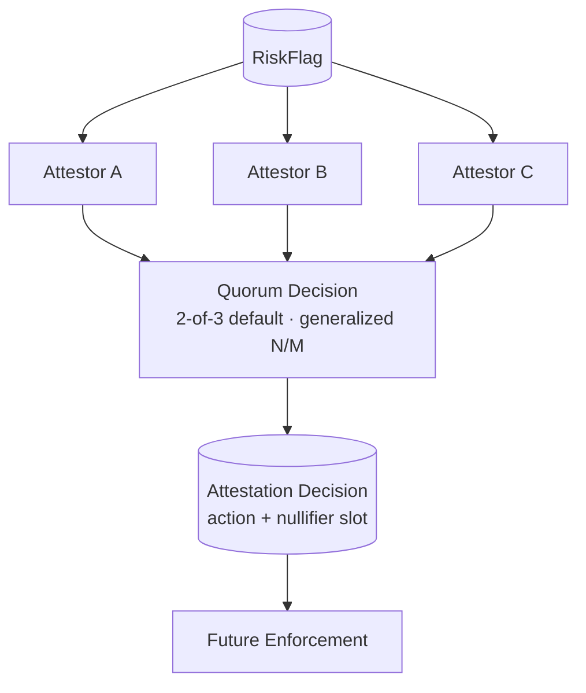

# BOND Phase 3 — Attestor System

> Independent verification between advisory flags and future enforcement.
> Decisions only: no slashing, no withdrawals, no chain, no keys, no network.

## 1. Phase 3 purpose

Convert untrusted `RiskFlag`s into verified quorum decisions that future
enforcement (and the Midnight contract) can consume — without trusting the
Risk Engine, any single attestor, or any off-chain clock.

## 2. Attestor architecture

```text
RiskFlag (+ evidence IDs, policy, time bounds)
  → eligibility filter (active attestors only, pluggable policy)
  → independent evaluation per attestor (own evidence view + strictness)
  → late/duplicate exclusion → generalized quorum count
  → expiry gate → outcome + Phase 1 Attestation record
```

Modules (`packages/attestor/src/`, sole dep `@bond/shared-types`):
`versions.ts`, `attestor.ts` (identity + eligibility), `policy.ts`
(quorum config), `evaluator.ts`, `quorum.ts`, `freshness.ts`,
`replay.ts`, `binding.ts`, `decision.ts` (orchestration),
`projections.ts` (public views).



## 3. Attestor model

`Attestor { attestorId, displayName?, organization, jurisdiction?,
status (active/suspended/retired), registeredAt }` + `AttestorProfile`
adding deterministic `strictness` (−1 lenient / 0 / +1 strict, ±0.1
threshold shifts). Abstract identity only — key material arrives via the
Phase 1 opaque `bindingRef` slot in later phases.

## 4. Independent evaluation

`evaluateIndependently` re-examines the flag; it never converts
flag → approval. Policy v1: non-actionable flags throw;
incomplete evidence → abstain; confidence < 0.5 → reject; low severity
→ abstain (below enforcement grade, never forced); otherwise approve
iff confidence meets severity thresholds (critical 0.6 / high 0.7 /
medium 0.85) shifted by strictness, borderline (±0.2) abstains.
Same flag demonstrably yields different verdicts across contexts
(tested: standard abstains where lenient approves).

## 5. Attestation lifecycle

Phase 1 terminology reused exactly — `requested | quorum-met |
decided | rejected | expired` — built only with shared domain
functions (`createAttestationRequest`, `recordVerdict`,
`issueDecision`). No second lifecycle: the service orchestrates the
domain object, and recording stops deterministically once it closes
(remaining evaluations stay in the outcome for audit).

## 6. Quorum model

Count unique attestors (first verdict wins, repeats reported);
abstentions recorded, never counted; confirms ≥ required →
`quorum-met`; rejects ≥ required → `rejected`; else `open`. Late
verdicts (at/after request expiry) excluded before counting.

## 7. Default 2-of-3 policy

`required=2/total=3`: every approval pair reaches quorum; any single
approval does not; two rejections reject. Verified per-pair in tests.

## 8. Generalized quorum

`createQuorumConfig` enforces `0 < required <= total` (integers);
tested with 1-of-1, 2-of-2, 3-of-5, and four invalid formations.
No governance/DAO — configuration arrives from policy and is validated.

## 9. Conflict handling

approve/reject/abstain → `open`; approve/reject/approve →
`quorum-met` (2 confirms); reject/reject/approve → `rejected`
(2 rejects); unanimous votes follow suit. Simultaneous threshold ties
(possible only when required ≤ total/2) resolve to confirms with a
recorded `threshold-tie` reason: quorum-met authorizes a decision,
never an execution — expiry, binding, and replay gates still apply.

## 10. Freshness

Injected `nowIso` everywhere; fresh ⇔ now strictly before expiry, so
exactly-at-boundary is expired (no racing expiry). Verdict-level
freshness excludes late votes before counting. Tested: fresh,
boundary, expired, plus malformed timestamps.

## 11. Replay protection

Pure check-then-add helpers over caller-held key sets
(`assertNotReplayed` throws `REPLAYED_ATTESTATION`;
`markConsumed` returns a new set); single-issuance decisions via the
Phase 1 `issueDecision` guard; deterministic nullifier slot
`bond-nullifier:<attestationId>:<riskFlagId>` on quorum (opaque
domain string — on-chain consumption is a later phase, no crypto
invented). Tested: first/second use, distinct keys, double issuance.

## 12. Subject binding

`verifySubjectBinding` rejects cross-agent and cross-flag reuse with
dimension-identifying errors; enforced at the decision boundary and
tested for both mismatch axes.

## 13. Evidence binding

`verifyEvidenceCoverage` requires the attestation to reference every
evidence item the flag cited (extras allowed, gaps rejected), so one
finding's verdicts cannot stand in for another's. Tested: full,
superset, gap, and empty coverage.

## 14. Attestor eligibility

`EligibilityPolicy` interface (future governance plugs in); default
`eligibility-v1` admits `active` attestors only. Ineligible profiles
are recorded in `ineligibleAttestors` and cast no votes (tested with a
suspended attestor). Duplicate identities collapse to first verdict.

## 15. Risk Engine trust boundary

The engine is input, not authority: evaluation re-derives approve /
reject / abstain from flag + evidence + policy, and tests prove all
three outcomes from the same flag shape. The attestor package does not
depend on `@bond/risk-engine` at all.

## 16. Enforcement trust boundary

Output is `DecisionOutcome` + `Attestation` only. Proven three ways
(boundary tests): comment-stripped source scan (no wallet/chain/
midnight/slash/bond-mutation references, no attestor↔risk-engine
coupling), dependency allowlist (`@bond/shared-types` only), and
output-shape tests (decision keys fixed; no enforcement tokens or
secrets in serialized output).

## 17. Privacy

Phase 1 model reused, no second model: public attestation views carry
IDs, status, threshold, vote counts, recommended action, and expiry —
never `bindingRef`s, nullifiers, rationale content, or evidence beyond
IDs. Leakage tests assert the forbidden tokens are absent.

## 18. Testing

26 attestor tests: evaluation (approve/reject/abstain/insufficient
evidence/disagreement/determinism), quorum (pairs/singles/triples/
N-M/invalid configs/duplicates/late), freshness (fresh/boundary/
expired), replay (first/second/distinct), binding (agent/flag/evidence
axes), identity/policy (validation, eligibility), decision paths
(quorum/reject/open/expired/ineligible/duplicate/custom-quorum/
determinism), projections (allowlist + leakage), boundaries
(imports/deps/output/secrets). Regression: all Phase 1 + Phase 2
suites stay green.

## 19. Future blockchain integration boundary

Downstream consumes `Attestation.decision { decisionId, action,
nullifier, expiresAt }` plus vote counts: the contract will verify
quorum signatures, freshness, binding, and nullifier consumption
(Phase 0 doc 06 §6.4, all `[CONTRACT-VERIFY]`). Nothing in this
package assumes how — IDs, thresholds, expiries, and nullifier slots
are the complete handoff surface.

## 20. Remaining unresolved questions

- Attestor admission/governance for a live network (interface ready,
  process undefined — needs a product/governance decision, Phase 10+).
- Quorum sizing for larger sets (mechanism ready; 2-of-3 remains the
  initial policy, raise with set growth per Phase 0).
- Binding-scheme choice (opaque slots reserved; `[VERIFY-MIDNIGHT]`).
- Severity→action mapping (critical→full-slash else partial-slash) is
  starting policy; slashing policy versioning may refine it (Phase 4).

## 21. Phase 3 acceptance criteria (status)

- [x] Independent evaluation with proven disagreement capability.
- [x] 2-of-3 default + generalized, validated N/M quorum.
- [x] Deterministic conflict rules incl. documented tie-break.
- [x] Injected-time freshness with boundary semantics.
- [x] Domain replay protection without invented crypto.
- [x] Subject + evidence binding with cross-attack tests.
- [x] Pluggable eligibility; duplicates collapse; determinism proven.
- [x] Privacy via Phase 1 model; leakage-tested projections.
- [x] Enforcement boundary proven by tests, not prose.
- [x] Zero new runtime dependencies; Phase 1 + Phase 2 suites green.
