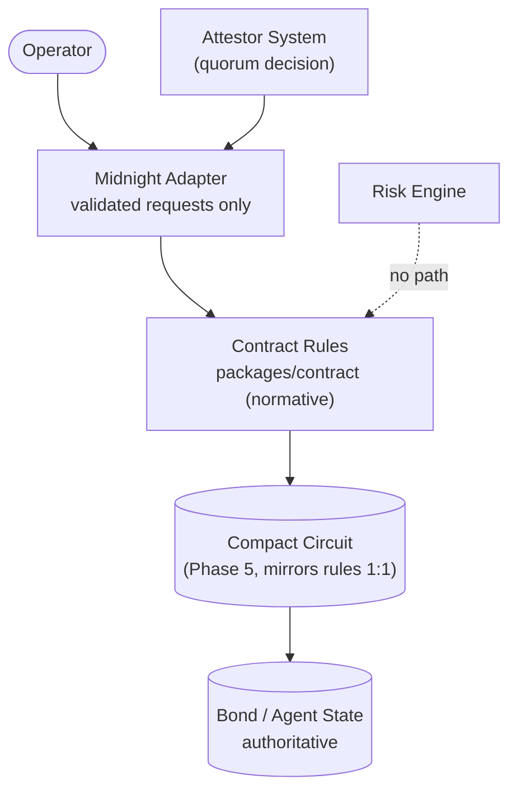
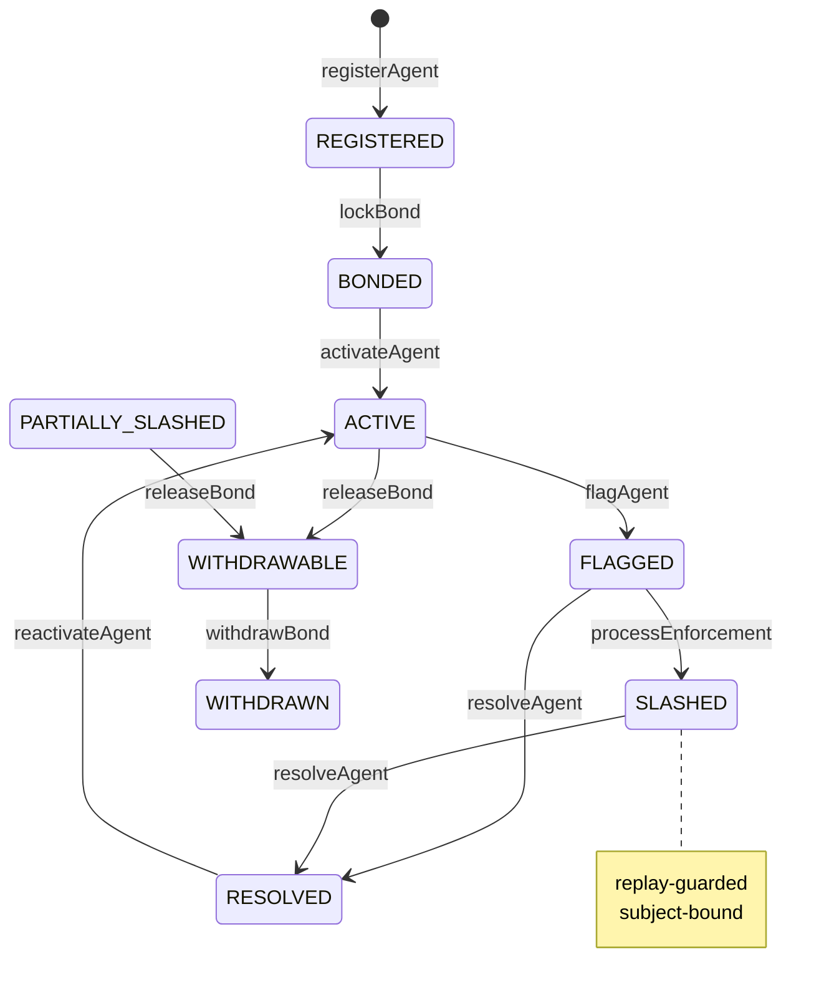

# BOND Phase 4 — On-Chain Enforcement Boundary

> The contract is the final authority. This phase specifies its exact
> rules as a tested, pure-TypeScript normative model plus a validated
> adapter seam — with zero faked blockchain behavior.

## 1. Phase objective

Define and locally validate everything about enforcement EXCEPT the
chain itself: authoritative state, entrypoints, guards, replay
protection, bindings, invariants, and the adapter interface that will
carry real generated modules in Phase 5.

## 2. Scope

In: contract state model, 8 entrypoints, authorization/binding/replay
guards, private/public separation, version metadata, adapter boundary
types + builders, comprehensive local tests, this documentation.
Out: React/wallet/Lace, PostgreSQL, REST, auth, Risk/Attestor changes,
ML, deployments, DUST, signing, key management, attestor networking,
backend orchestration, frontend tx status, production infra.

## 3. Non-goals

No `.compact` source (no compiler to verify it against), no compiled
artifacts, no generated bindings, no testnet/mainnet contact, no token
transfers real or fake.

## 4. Verified Midnight toolchain versions

**VERIFIED** (commands run 2026-10-06, see §24):

- `compact`/`compactc` binary: **absent** (`which` negative).
- `~/.compact`: **absent**. Local Midnight packages installed: **none**.
- npm registry reachable; `@midnight-ntwrk/midnight-js-contracts`
  latest **observed at 4.1.1**; `...-http-client-proof-provider`
  observed at 4.1.1. Observed ≠ integrated: neither is installed.
- Node v24.21.0, npm 11.19.0 (repo pins Node 24).

**ASSUMED** (working hypotheses, not capabilities): Compact compiles
to contract + ZK artifacts consumable from TS via generated modules;
deployment uses generated modules plus artifacts (per official docs
descriptions — exact APIs unverified).

**UNRESOLVED**: compiler acquisition path + version, Compact syntax
version, generated-module API shape, proof-provider wiring, wallet
signing flow, network endpoints, DUST/fee mechanics, private-value
representation on-chain. All are Phase 5 entry criteria, not Phase 4
deliverables.

## 5. Compact compiler setup

None — deliberately. Setup is blocked on acquiring a verified
compiler; the setup procedure itself is the first Phase 5 task and
must record versions here before any `.compact` is authored.

## 6. Contract architecture

`packages/contract` holds the normative rules; `contracts/` holds
only this README until the compiler arrives; `packages/midnight-adapter`
is the sole seam. Risk Engine has no caller form at the boundary.

## 7. State model

Ledger: agents (id, operator, status, bond link, slash count, policy),
bonds (commitment/slashed totals as opaque digit strings, status,
single-use withdrawal flag), consumed enforcement nullifiers, contract

- policy versions. Amounts: digit strings, BigInt math, no floats.

## 8. Agent lifecycle mapping

Contract enum `REGISTERED|BONDED|ACTIVE|FLAGGED|SLASHED|RESOLVED`
(no `ATTESTED` — decision record only, per Phase 1). Dropped states:
`UNREGISTERED` = ledger absence; `SUSPENDED` = off-chain only;
`WITHDRAWABLE` = bond-level; bond `PENDING/CREATED/FAILED` = mirror
states (contract records confirmed locks directly as `ACTIVE`).

## 9. Bond lifecycle mapping

Contract enum `ACTIVE|LOCKED|ACTIVE…` → full set
`ACTIVE|LOCKED|PARTIALLY_SLASHED|FULLY_SLASHED|WITHDRAWABLE|WITHDRAWN|
CANCELLED`. `LOCKED` is representable (review/dispute holds) though
the Phase 4 entrypoints move through it only via enforcement paths;
full lock/unlock circuits are Phase 5 contract work if policy needs
them. No backwards moves anywhere.

## 10. Contract entrypoints

`registerAgent`, `lockBond` (confirmed lock; no fake transfers),
`activateAgent`, `flagAgent`, `resolveAgent`, `reactivateAgent`
(`RESOLVED→ACTIVE`, requires a live bond — added in Phase 4 to close
the post-incident loop), `processEnforcement`, `releaseBond`,
`withdrawBond`. Each lists caller/subject/state/replay/input checks
in code order; authorization first, fail-closed throughout.

## 11. Authorization model

Two caller forms: `operator` (id must equal the owning operator) and
`enforcement` (carries its authorizing decisionId; maps to
quorum-signature verification on-chain). No other caller exists —
notably no risk-engine caller, so engine output has no path to
enforcement except through an attested decision.

## 12. Enforcement model

`processEnforcement` accepts only a bound, policy-matched, fresh,
unused decision against a `FLAGGED` agent with a slashable bond;
applies partial (validated amount ≤ remainder) or full (remainder by
definition) slash; moves agent → `SLASHED`, bond →
`PARTIALLY|FULLY_SLASHED`, consumes the nullifier, returns a receipt.
Deterministic: same ledger + input ⇒ same ledger + receipt.

## 13. Replay protection

Consumed-nullifier set on enforcement (checked before expiry/state so
replays report as replays); single-use withdrawal flag; single bond per
agent; duplicate IDs rejected. Proven: first succeeds, replay fails,
distinct succeeds, cross-agent fails, bad refs fail.

## 14. Subject binding

Decision↔agent↔bond triple equality enforced before any state read for
effects; adapter builders re-verify attestation↔flag consistency.
Negative tests: wrong agent, unknown bond, mismatched flag, reused
decision, expired decision, unauthorized operator.

## 15. Privacy model

Phase 0/1 model reused unchanged: amounts, operators, nullifiers, and
evidence stay internal; gateways (attested decisions, future ZK/release
publications) are the only crossings. No custom crypto anywhere.

## 16. Public/private state

Public ledger view: agent ids, statuses, bond status bands, slash
counts, versions — sorted for determinism. Leakage tests assert
amounts, operator ids, nullifiers, and field names are absent from
serialized output.

## 17. Contract invariants

All 10 Phase 4 invariants hold and are tested: (1) no double
registration, (2) no cross-operator mutation, (3) no double
withdrawal, (4) no double slash execution, (5) no cross-agent slash,
(6) no engine-only enforcement (no caller form + no flag parameter),
(7) no invalid/expired decisions, (8) no backwards/invalid
transitions, (9) no private disclosure, (10) deterministic effects
(repeat-input ⇒ repeat-output, asserted in tests).

## 18. Security model

Fail-closed ordering (auth → binding → policy → replay → expiry →
state → amount); replay dominates state so consumed requests report
honestly; amounts re-validated at both adapter and contract layers;
withdrawal single-use; release blocked while flagged; reactivation
requires live backing value.

## 19. Adapter boundary

`@bond/midnight-adapter` (`adapter-v1`, targets `bond-contract-v1` /
`bond-policy-v1`): `ContractMetadata` (declares
`unverified-toolchain` + observed versions), pure builders
(`buildRegistration/BondLock/Enforcement/WithdrawalRequest`) that
validate freshness, subject consistency, formats, and partial-slash
amounts — then stop. `connectMidnight()` still throws (Phase 5 owns
sessions/wallets/deployment). No business rules in the adapter; no
generated types pretended.

## 20. Test strategy

Contract suites: lifecycle (registration/duplicates/auth/bonds/
activation/flag/resolve/reactivation/invalid moves), enforcement
(valid slash/replay/auth/binding/expiry/policy/full-exhaustion/
over-range/engine-independence), withdrawal (release-gating/single-use/
locked/slashed-remainder), projections (allowlist + leakage),
architectural boundary (import + dependency scans). Adapter suites:
builder validation, expiry/binding/amount rejections, metadata honesty,
boundary scans, no-fake-connection. Regression: all Phase 1–3 suites.

## 21. Known limitations

- No executable chain artifact: all "contract tests" run the
  normative rule model locally, not on Midnight.
- `LOCKED` reachability is partial (no standalone lock/unlock
  entrypoint yet).
- Release conditions are state-based (not flagged + right state),
  not full policy evaluation — policy circuits are Phase 5.
- Amounts are opaque strings; on-chain numeric encoding is
  `[UNRESOLVED]` pending the compiler.
- Reputation is not contract state (off-chain derived, per Phase 0).

## 22. Unresolved Midnight-specific questions

Compiler source/version; Compact syntax version; generated-module
shape; proof-provider + wallet integration; network endpoints;
fee/DUST mechanics; private amount representation; event/indexing
story. Each blocks a named Phase 5 task — none blocks the rule model.

## 23. Phase 5 dependencies

1. Acquire + pin verified compiler; record versions in §4.
2. Author `contracts/bond.compact` mirroring `packages/contract` 1:1
   (any divergence needs an ADR).
3. Compile; commit artifacts + generated bindings.
4. Implement adapter submission behind existing builder names.
5. Local-network boundary tests (contract boundary only, no public nets).

## 24. Mermaid architecture/state diagrams

System fan-in (§6 above); lifecycle maps:

