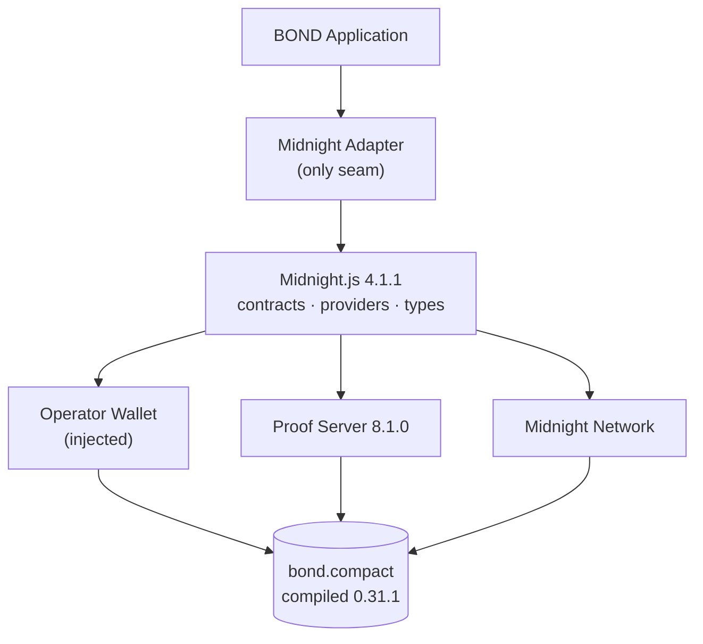

# BOND Phase 5 — Midnight Integration

> Real Compact contract, real compilation, real Midnight.js wiring —
> with live-network execution honestly reported as not yet performed.

## 1. Verified toolchain versions (VERIFIED)

| Component          | Version                          | How verified                                                                |
| ------------------ | -------------------------------- | --------------------------------------------------------------------------- |
| compact CLI        | 0.5.3                            | `compact --version`, `/home/asrar/.local/bin/compact`                       |
| Compact compiler   | 0.31.1                           | `compact compile --version`                                                 |
| Compact language   | 0.23.0                           | `compact compile --language-version`                                        |
| Ledger / runtime   | ledger-8.0.2 / 0.16.0            | compiler `--ledger-version` / `--runtime-version`                           |
| midnight-js family | 4.1.1                            | installed: contracts, protocol, network-id, types, utils                    |
| compact-js         | 2.5.1                            | installed; `CompiledContract` import verified at runtime                    |
| compact-runtime    | 0.16.0                           | installed exact; matches compiler runtime-version                           |
| providers          | 4.1.1                            | installed: indexer-public-data, http-client-proof, node-zk-config           |
| proof-server image | midnightntwrk/proof-server:8.1.0 | cached; container started, served :6300, removed                            |
| wallet SDK         | —                                | NOT installed (observed 1.2.0 elsewhere); wallet is injected, never bundled |

Two toolchain facts discovered live: `compact-js@2.5.3` is
uninstallable here (phantom `@midnight-ntwrk/ledger-v9@alpha` dep) →
pinned to verified-installable **2.5.1**; `@midnight-ntwrk/compact-js`
`midnight-js-compact` is a compiler-fetcher binary with no library
entry → **removed** as dead weight. `contract-info.json` confirms
compiler 0.31.1 / language 0.23.0 / runtime 0.16.0 on our artifacts.

## 2. Compact source (`contracts/bond.compact`)

Nine circuits mirroring `@bond/contract` 1:1 — `registerAgent`,
`lockBond`, `activateAgent`, `flagAgent`, `resolveAgent`,
`reactivateAgent`, `processEnforcement`, `releaseBond`, `withdrawBond` —
over public `agents`/`bonds` maps, a `usedNullifiers` set, and counters.
Only patterns proven on this toolchain are used (`export ledger`,
`witness`, `disclose`, `persistentHash`, `pad`, struct Map values,
overwrite-by-insert, `Counter.increment`).

## 3. Compilation

```bash
npm run compact --workspace=@bond/midnight-adapter
# → compact compile contracts/bond.compact contracts/managed/bond
```

Real compiler errors fixed during authoring (not invented around): a
`pure circuit` calling a witness, and witness-derived branch values
reaching ledger writes (restructured to branch on the disclosed action).
Output: `contract/` TS bindings, `zkir/` + `keys/` per circuit,
`compiler/contract-info.json` (~25 MB total, committed — required for
proving).

## 4. Generated artifacts

`contracts/managed/bond/`: `contract/index.{js,js.map,d.ts}`
(`Witnesses<PS>`, `Impure/Provable/Circuits<PS>`, `Ledger` view,
`Contract` class, `ledger(state)` projector), `zkir/*.zkir/*.bzkir`,
`keys/*.prover/*.verifier`, `compiler/contract-info.json`. Generated
code is excluded from lint/format (toolchain-owned).

## 5. Midnight.js APIs actually used

`setNetworkId`, `indexerPublicDataProvider`,
`httpClientProofProvider`, `NodeZkConfigProvider`,
`CompiledContract.{make,withWitnesses,withCompiledFileAssets}`,
`createUnprovenDeployTx` + `submitTxAsync` (low-level deploy),
`submitCallTxAsync` (submit → txId), `findDeployedContract`,
`getPublicStates` + generated `ledger(state.data)`,
`watchForTxData` + `SucceedEntirely` gating. Every name above was
imported and exercised from the installed `node_modules` copies.

## 6. Provider architecture

Reads: indexer + node-ZK-config + HTTP-proof providers from config
URLs. Writes: wallet+midnight providers **injected** (operator wallet,
e.g. Lace session — adapter never creates keys/wallets); private-state
provider injected (owned by the wallet layer). Witness callbacks read
per-call private state; values stay in operator memory.

## 7. Wallet architecture

No wallet code in BOND. REAL handles require an injected
`WalletProvider & MidnightProvider`; without one, `connectMidnight`
throws `MIDNIGHT_UNAVAILABLE` — never a fake session.

## 8. Proof-server architecture

`httpClientProofProvider(proofServerUrl, zkConfigProvider)`; default
`http://127.0.0.1:6300`. Verified live: image 8.1.0 started, served
`0.0.0.0:6300` (actix log captured), probe removed afterwards. No
proofs generated in Phase 5 (no live circuit execution yet).

## 9. Deployment process

`deployBondContract` (low-level pattern): unproven tx → address +
submit → store private state. No deployment performed (needs funded
wallet + network). `findBondContract` re-attaches to a deployed
address from `BOND_CONTRACT_ADDRESS`.

## 10. Transaction lifecycle

Phase 1 states preserved: submit → `SUBMITTED` (txId only);
`confirmOperation` watches finality → `CONFIRMED` **only** on
`SucceedEntirely`, else `FAILED`. SIMULATED receipts stop at
`SUBMITTED`/`FAILED` with `sim[-failed]-` ids — confirmation is a
finality concept, meaningless without a chain.

## 11. Configuration

`resolveMidnightConfig(env)`: empty/`simulated` → SIMULATED (default);
`off`/`unavailable` → UNAVAILABLE; `undeployed`/`preprod` (+ `preview`,
`mainnet` names accepted) → REAL with endpoint defaults + overrides;
unknown names throw. Keys documented in `.env.example`; secrets never
read from env (no such code exists).

## 12. Simulated vs real mode

|           | SIMULATED                 | REAL                       | UNAVAILABLE      |
| --------- | ------------------------- | -------------------------- | ---------------- |
| Executes  | normative rules in memory | Midnight.js submit/confirm | nothing (throws) |
| Receipts  | `sim-*`, mode-labeled     | chain txIds, mode-labeled  | n/a              |
| CONFIRMED | never                     | only on finality           | never            |
| Use       | dev/tests without network | funded wallet + network    | kill-switch      |

## 13. Security boundaries (tested, not just documented)

Risk Engine and Attestor packages are absent from the seam (import
scan); chain deps owned solely by `@bond/midnight-adapter`; no key
creation/signing/network primitives beyond the verified list;
CONFIRMED gated on finality; private amounts/operators/nullifiers
absent from public reads (SIM reads reuse `@bond/contract`
projections; REAL reads map generated ledger views to bands).

## 14. Tests

Adapter suites: encoding round-trips + validation, config
parsing/modes, witness shape + compiled-contract build from real
artifacts, SIMULATED full lifecycle incl. replay/double-withdraw
failures + determinism, REAL-guard refusals, circuit-arg encoding,
architectural boundary scans. Regression: all Phase 1–4 suites green.

## 15. Limitations (ASSUMED / UNRESOLVED)

- ASSUMED: indexer `/api/v4/` paths and undeployed ports follow the
  official local-dev layout (config-overridable, not yet dialed).
- UNRESOLVED: on-chain wall-clock (expiry enforced adapter-side);
  on-chain quorum-signature verification (adapter validates the Phase 3
  object pre-submit); live deploy/submit/confirm (needs funded wallet +
  running devnet — code complete, execution pending); DUST/fee funding;
  standalone LOCKED reachability circuits.
- Divergence from Phase 4 TS model (documented, no ADR needed —
  behavior preserved): full/partial is proven in-circuit against
  reopened commitments rather than computed from stored totals
  (stronger, made possible by real ZK); `registerAgent` takes no
  commitment arg (derived in-circuit, removing all off-chain hashing).

## 16. Unresolved Midnight-specific questions

Devnet stand-up + faucet funding procedure; fee estimation for our 9
circuits; indexer sync behavior for `watchForTxData` timeouts;
private-state backup story for operators; Lace session shape for the
injected wallet (browser track).

## 17. Recommended next step (Phase 6 entry)

Stand up the local devnet (node + indexer + proof server via
compose), fund a dev wallet, and run deploy → register → lock →
enforce → withdraw end-to-end against REAL mode; record observed fees,
finality times, and any ledger-time API findings back into §15.


