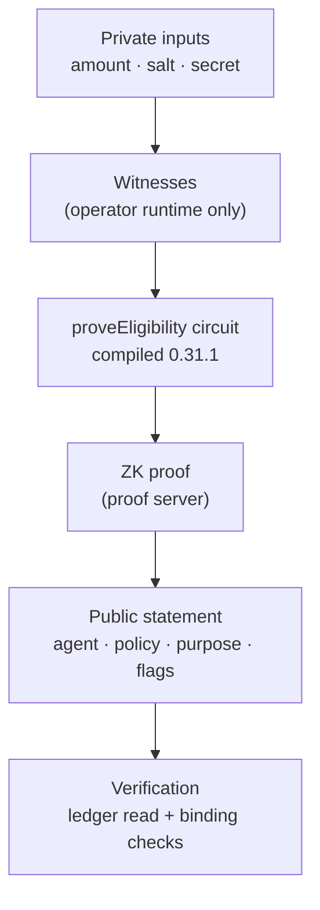

# BOND Phase 6 — ZK Eligibility & Privacy

> Operators prove "an eligible bond satisfies policy for this agent"
> without revealing the amount, salt, or secret. Real Compact circuits,
> really compiled; live-network proof submission honestly pending.

## 1. Phase 6 objective

Implement the Phase 0 §8.2 eligibility statement — collateral
sufficiency, policy compliance, clean standing — as three compiled
circuits plus a BOND-level proof lifecycle, nullifier discipline,
subject binding, and leakage-tested public verification.

## 2. Privacy model (VERIFIED — enforced by the toolchain + tests)

PRIVATE (witnesses only, never stored, never returned): exact bond
amount, commitment salt, operator secret, blinding/randomness,
evidence content, wallet material. There is no adapter type with a
field for any of these — `EligibilityProof` carries IDs, policy,
purpose, nullifier, expiry, status, txId only.

PUBLIC: agent binding, eligibility result, proof validity/status,
nullifier-consumed flags, policy version, purpose, tx status.
Crossings happen only via proven statements (ZK verification) and
attested decisions, per Phase 0 §8.1.

## 3. Eligibility statement

"the operator controls an eligible bond satisfying the configured
policy for this agent/context." Concretely, `proveEligibility`
asserts in-circuit: operator opens the stored commitment, agent in
BONDED/ACTIVE, bond ACTIVE/PARTIALLY_SLASHED, reopened amount ≥
disclosed `requiredMinimum`, fresh domain-separated nullifier.
Policy thresholds are explicit caller input
(`requiredMinimumMinorUnits`) — Phase 0 defines no figure, so none
is invented.

## 4. Public/private data

Ledger holds commitments, status codes, counts, nullifiers, and the
eligibility record (policy hash, purpose, revoked/consumed flags).
`toPublicEligibilityView` allowlists seven fields; tests serialize
every public surface against canary secrets and forbid field names
(`amountMinorUnits`, `commitmentSalt`, `operatorSecret`, `witness`,
`blinding`).

## 5. Proof lifecycle

`CREATED → SUBMITTED → VERIFIED → CONSUMED`, plus `EXPIRED`,
`REPLAYED`, `FAILED`; guarded deterministic transitions, expiry
evaluated against injected `nowIso`. Kinds: `ZK-PROOF` (chain-proven)
vs `SIMULATED-FIXTURE` (labeled, constructed locally) — runtime
validated, so forged kinds fail construction. A fixture is never
reported as verified: SIM records carry `SIMULATED-FIXTURE` end to
end, and verification reads the kind.

## 6. Nullifier model (VERIFIED mechanism, BOND semantics)

`usedEligibilityNullifiers: Set<Bytes<32>>` on ledger, consumed at
prove and redeem time, checked before any effect. Domain separation
is structural: adapter prefixes (`eligibility-proof:` /
`eligibility-redeem:`) hashed into a separate bytes-domain from
enforcement nullifiers, stored in a separate ledger set — cross
purpose reuse is impossible at both layers. No custom crypto:
`persistentHash` commitments and ledger sets are Compact/Midnight
primitives.

## 7. Binding model

Agent (ledger key), policy (hash recorded; verifiers compare against
the required policy — V1 proofs never satisfy V2 queries), purpose
(code asserted and re-checked), lifecycle (revoked/consumed flags),
expiry (adapter-enforced, see §15). Cross-agent reuse fails (no
record under B); cross-policy fails (hash mismatch); altered inputs
fail (record comparison, tested).

## 8. Compact circuits (VERIFIED — compiled 0.31.1, 12 circuits)

Appended to `contracts/bond.compact`; existing 9 circuits untouched.
`proveEligibility` (guards above + records the public statement),
`revokeEligibility` (operator invalidates), `consumeEligibility`
(single-use redemption with its own nullifier). Branching only on
disclosed values (compiler-enforced disclosure discipline, as in
Phase 5). Recompiled artifacts committed (`contract-info.json`
confirms 12 circuits, compiler 0.31.1 / language 0.23.0).

## 9. Midnight integration (VERIFIED APIs only)

Unchanged provider/wallet/proof architecture from Phase 5. New:
`submitEligibilityProof/Revocation/Redemption` (submit → SUBMITTED,
confirm via `confirmOperation` → CONFIRMED only on `SucceedEntirely`),
`readEligibilityRecord` (indexer → generated `ledger()` view →
public fields), `eligibilityProofCircuitArgs` (all-public arg
encoding). No new dependencies; no invented APIs.

## 10. Adapter API

`createEligibilityProof` (validated construction),
`transitionEligibilityProof`, `deriveProofNullifier` /
`deriveRedemptionNullifier`, `eligibilityCircuitArgs`,
`createSimulatedEligibilityStore` (prove/revoke/consume/read with
on-chain-equivalent validation, labeled), `checkEligibility`
(pure verifier), `toPublicEligibilityView`, plus the three REAL
submitters and the REAL reader in `client.ts`. BOND-level types
throughout; Midnight.js stays inside REAL branches.

## 11. Simulation mode

The SIM store applies identical validation (binding, expiry, replay,
revocation, consumption) over public fields only — behavioral parity
for development and tests, explicitly not zero-knowledge. Every SIM
receipt/record carries `SIMULATED` / `SIMULATED-FIXTURE` labels
asserted by tests.

## 12. Real mode

REAL paths are complete and typed: arg encoding, private-state
wiring, submit, finality-gated confirmation, ledger reads. Not yet
executed (needs funded wallet + running devnet — same standing
blocker as Phase 5 §15). REAL guards are tested (refusals without
providers); live submission is reported, not faked.

## 13. Security model (tested)

Import scan keeps risk/attestor out of the seam and limits chain deps
to the verified list; no key creation/signing primitives; forged
kinds, cross-agent/policy/purpose reuse, replays, expiries, and
altered inputs all rejected in tests; error messages carry IDs only
(canary-tested); "no confirmed violation" (no-record) stays distinct
from "proven safe" (eligible) via explicit reasons.

## 14. Tests

`eligibility.test.ts` (13 areas: valid/invalid/malformed input,
agent/policy/purpose/expiry binding, replay + consumption,
cross-agent, revocation, leakage incl. field-name allowlists,
fixture labeling, lifecycle determinism, arg encoding incl. a
SHA-256 domain-separation assertion, altered inputs, error-message
canaries, nullifier domain separation) plus REAL-guard tests in
`client.test.ts` and artifact-compatibility via `contract-info.json`
(12 circuits). Regression: all Phase 1–5 suites green.

## 15. Limitations

- ASSUMED: undeployed ports/indexer paths (overridable, undialed).
- UNRESOLVED: on-chain wall-clock (expiry stays adapter-side, as in
  Phase 5 D4); live proof submission/confirmation (funded wallet +
  devnet); fee estimates for the 3 new circuits; private-state backup;
  Lace session shape. Only `collateral-sufficiency` (purpose 1)
  exists; further purposes are additive.
- SIM fixtures prove nothing cryptographic — stated in code, tests,
  and this doc.

## 16. Unresolved questions

Devnet + faucet procedure (shared with Phase 5); whether future
gates (e.g. withdrawal) should consume eligibility on-chain;
additional ZK purposes (clean-standing standalone proof vs the
status-guard already in-circuit); reputation ZK (Phase 0 non-goal,
unchanged).

